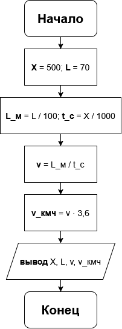

# Домашнее задание к работе 2

## Условие задачи
Пленка поверхностного натяжения позволяет удерживать человека на поверхности воды в течение **X** миллисекунд, длина одного шага человека **L** см. Определить минимальную скорость передвижения человека по воде как по суше. (Вариант 14)

## 1. Алгоритм и блок-схема

### Алгоритм
1. **Начало**
2. Объявить константы:
   - `MS_PER_SECOND` = 1000 (мс/с) — перевод миллисекунд в секунды.
   - `CM_PER_METER` = 100 (см/м) — перевод сантиметров в метры.
   - `MS_TO_KMH` = 3.6 — коэффициент перевода м/с в км/ч.
3. Задать исходные данные:
   - `X` = 500 (мс) — время удержания человека на пленке поверхностного натяжения.
   - `L` = 70 (см) — длина одного шага человека.
4. Перевести исходные данные в СИ:
   - `L_meters` = `L` / `CM_PER_METER` (м)
   - `t_seconds` = `X` / `MS_PER_SECOND` (с)
5. Вычислить минимальную скорость. Человек движется «как по суше», если успевает сделать шаг, пока пленка его держит, то есть проходит L метров за t секунд:
   - `v_min` = `L_meters` / `t_seconds` (м/с)
6. Перевести скорость в км/ч:
   - `v_min_kmh` = `v_min` * `MS_TO_KMH`
7. Вывести результаты расчетов с подстановкой всех значений в текст.
8. **Конец**

### Блок-схема


## 2. Реализация программы

```c
#include <stdio.h>
#include <locale.h>

int main() {
    const int MS_PER_SECOND = 1000;
    const int CM_PER_METER = 100;
    const float MS_TO_KMH = 3.6f;

    int X = 500;
    int L = 70;

    setlocale(LC_CTYPE, "RUS");

    float L_meters = (float) L / CM_PER_METER;
    float t_seconds = (float) X / MS_PER_SECOND;

    float v_min = L_meters / t_seconds;
    float v_min_kmh = v_min * MS_TO_KMH;

    printf("РАСЧЕТ МИНИМАЛЬНОЙ СКОРОСТИ ХОДЬБЫ ПО ВОДЕ\n");
    printf("===========================================\n\n");
    printf("УСЛОВИЯ:\n");
    printf("- Пленка поверхностного натяжения удерживает человека\n");
    printf("  на поверхности воды в течение X = %d мс.\n", X);
    printf("- Длина одного шага человека: L = %d см.\n\n", L);

    printf("РАСЧЕТ:\n");
    printf("- Перевод единиц: L = %d см = %.2f м; X = %d мс = %.3f с.\n", L, L_meters, X, t_seconds);
    printf("- Минимальная скорость: v = L / t = %.2f м / %.3f с = %.3f м/с.\n\n", L_meters, t_seconds, v_min);

    printf("===========================================\n");
    printf("ОТВЕТ: минимальная скорость передвижения человека по воде\n");
    printf("как по суше составляет %.2f м/с, или %.2f км/ч.\n", v_min, v_min_kmh);

    return 0;
}
```

## 3. Результаты работы программы

```
РАСЧЕТ МИНИМАЛЬНОЙ СКОРОСТИ ХОДЬБЫ ПО ВОДЕ
===========================================

УСЛОВИЯ:
- Пленка поверхностного натяжения удерживает человека
  на поверхности воды в течение X = 500 мс.
- Длина одного шага человека: L = 70 см.

РАСЧЕТ:
- Перевод единиц: L = 70 см = 0.70 м; X = 500 мс = 0.500 с.
- Минимальная скорость: v = L / t = 0.70 м / 0.500 с = 1.400 м/с.

===========================================
ОТВЕТ: минимальная скорость передвижения человека по воде
как по суше составляет 1.40 м/с, или 5.04 км/ч.
```

## 4. Информация о разработчике
Сбоев Даниил, бОТИ-261
